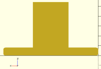

# OpenSCAD detailed steps for the Idler Holder


Check the source file [idler_holder.scad](src/idler_holder.scad)

You may want to check the steps for the [idler tensioner](./idler_tensioner.md) 

# Steps

## Step 00: Includes and module creation

```cpp
include <oscad_utils/bolt_sizes.scad> // include to use the constants
use <oscad_utils/fillet.scad>
use <oscad_utils/bolts.scad>  
// where the constants are defined
include <idler_cte.scad>

module idler_holder()
{

```


## Step 01: Create the base
Everything else will cut the box:

```cpp
  difference () {
    union () 
    {
      difference () {
      /* --------------- step 01 --------------------------- 
         the base, to attach it to the aluminum profiles
         

                                                Z      Z
                                                :      :
                      .. _______________________:      :________
          hold_bas_h.+..|_______________________|      |________|......Y
 
                         .... hold_bas_w ........
                        :                        :
                 X......:________________________:....
                        |                        |    :
                        |                        |    + hold_bas_l
                        |________________________|....:
                                                 :
                                                 Y
        */

        cube([hold_bas_w, hold_bas_l, hold_bas_h]);
```


## Step 02: Fillet the base

```cpp
      /* --------------- step 02 --------------------------- 
         Fillet the base
         The piece will be printed on the XZ plane, so this fillet will be 
         raising
       

                                              Z
                                              :
                     f4_______________________f2
               X......(_______________________)
                     f3                        f1
        */
        // fillet f1
        fillet_dif_y (r=in_fillet, h = hold_bas_l, xdir=-1, zdir=-1, fillet=1);
        // fillet f2
        translate ([0,0, hold_bas_h])
          fillet_dif_y (r=in_fillet, h = hold_bas_l, xdir=-1, zdir=1, fillet=1);
        // fillet f3
        translate ([hold_bas_w,0, 0])
          fillet_dif_y (r=in_fillet, h = hold_bas_l, xdir=1, zdir=-1, fillet=1);
        // fillet f4
        translate ([hold_bas_w,0, hold_bas_h])
          fillet_dif_y (r=in_fillet, h = hold_bas_l, xdir=1, zdir=1, fillet=1);
      } //end of difference

```


## Step 03: The main box

```cpp
      /* --------------- step 03 --------------------------- 
         The main box
                                  aluprof_w   Z      Z
                                       ..+....:      :
                .............. _______:       :      :____________
                :             |       |       :      |            |
                :             |       |       :      |            |
        hold_h +:             |       |       :      |            |
                :             |       |       :      |            |     
                :      _______|       |_______:      |________    |
            X...:.....(_______|_______|_______)      |________|___|...Y
                                                     :            :
                       .... hold_bas_w ........      :.. hold_l...:
                      :                        :
                      :        .hold_w.        :
                      :       :       :        :
               X......:_______:_______:________:....
                      |       |       |        |    :
                      |       |       |        |    + hold_bas_l
                      |_______|       |________|....:
                              |       |        :
                              |_______|        :
                                               :
                                               :
                                               Y

      */
      // union: element 2
      translate ([aluprof_w,0,0])
      {
        difference () {
          cube([hold_w, hold_l, hold_h]);

```




## Step 04: Fillets on top

```cpp
      /* --------------- step 04 --------------------------- 
         Fillets on top
                                  aluprof_w   Z
                                       ..+....:
                .............f2_______f1      : 
                :             /       \       :
                :             |       |       :
        hold_h +:             |       |       :
                :             |       |       :
                :      _______|       |_______:
            X...:.....(_______|_______|_______)
      */

          // Fillet f1
          translate ([0,0, hold_h])
            fillet_dif_y (r=in_fillet, h=hold_l, xdir=-1,zdir=1,fillet=1);
          // Fillet f2
          translate ([hold_w,0, hold_h])
            fillet_dif_y (r=in_fillet, h=hold_l, xdir=1,zdir=1,fillet=1);
 

```


## Step 05: Large chamfer at the bottom

```cpp
      /* --------------- step 05 --------------------------- 
         large chamfer at the bottom

                                              Z      Z
                                              :      :
        Option A               _______        :      :____________
                              /       \       :      |            |
                              |       |       :      |            |
                              |_______|       :      |            |
                              |       |       :      |           /       
                       _______|_______|_______:      |________ /  
            X.........(_______________________)      |________|.......Y
                                                     :            :

        
                                              Z      Z
                                              :      :
        Option B               _______        :      :____________
                              /       \       :      |            |
                              |       |       :      |            |
                              |       |       :      |            |
                              |_______|       :      |            |      
                       _______|       |_______:      |________   /  
            X.........(_______|_______|_______)      |________|/......Y
                                                     :            :
                                                                    
       */

          // option B: using more material (probably sturdier)
          //chmf_rad = min(hold_l - hold_bas_l,
          //               hold_h - (tens_h+2*wall_thick));
          // option A: using less material
          chmf_rad = min(hold_l-hold_bas_l+ hold_bas_h,
                         hold_h + hold_bas_h - (tens_h+2*wall_thick));
          translate ([0, hold_l,0])
            fillet_dif_x (r=chmf_rad, h= hold_w,
                          ydir=1, zdir=-1, fillet=0);


```
Option A:


Option B:


## Step 06: Hole for the tensioner

```cpp
      /* --------------- step 06 --------------------------- 
         Hole for the tensioner
                                              Z      Z
                                              :      :
                               _______        :      :____________
                              /  ___  \       :      |c2..........|
                              | |   | |       :      | :          |
                              | |___| |       :      |c1..........|
                              |_______|       :      |            |      
                       _______|       |_______:      |________   /  
            X.........(_______|_______|_______)      |________|/......Y

      */

          translate ([wall_thick-tol/2, hold_l-tens_l_inside,tens_pos_h-tol/2])
          {
            difference () 
            {
              cube([tens_w_tol, tens_l_inside+1, tens_h_tol]);
              // chamfers on the nut corner. Chamfer c1
              fillet_dif_x (r=2*in_fillet-tol, h=tens_w_tol,
                            ydir=-1, zdir=-1, fillet=0);   
              // chamfer c2
              translate([0,0,tens_h_tol])
                fillet_dif_x (r=2*in_fillet-tol, h=tens_w_tol,
                              ydir=-1, zdir=1, fillet=0); 
              // Optional chamfers, only if they have been done in the tensioner
              if (opt_tens_chmf == 1) { // optional tensioner chamfer
                fillet_dif_z (r=2*in_fillet-tol, h=tens_h_tol,
                              xdir=-1, ydir=-1, fillet=0);   
                translate([tens_w_tol,0,0])
                  fillet_dif_z (r=2*in_fillet-tol, h=tens_h_tol,
                                xdir=1, ydir=-1, fillet=0); 
              }

            }
          } 

```


Optional chamfers:


## Step 07: A hole to be able to see inside, could be on one side or both

```cpp
      /* --------------- step 07 --------------------------- 
         A hole to be able to see inside, could be on one side or both
                                              Z      Z
                                              :      :
                               _______        :      :____________
                              /. ___ .\       :      |  ._______ .|
                              |.|   |.|       :      | :|_______| |
                              | |___| |       :      |  ..........|
                              |_______|       :      |            |      
                       _______|       |_______:      |________   /  
            X.........(_______|_______|_______)      |________|/......Y

      */
          if (hold_hole_2sides == 1) {
            translate ([-1,
                        wall_thick + nut_holder_thick,
                        tens_pos_h +  tens_h /2 - m4_nut_ap_tol ])
              cube([hold_w+2,
                    hold_l - nut_holder_thick - 2* wall_thick,
                    2*m4_nut_ap_tol]);
          } else { // one side only
            translate ([hold_w-wall_thick-1,
                        wall_thick + nut_holder_thick,
                        tens_pos_h +  tens_h /2 - m4_nut_ap_tol ])
              cube([wall_thick+2,
                    hold_l - nut_holder_thick - 2* wall_thick,
                    2*m4_nut_ap_tol]);
          }

```


## Step 08: Hole for the leadscrew

```cpp
      /* --------------- step 08 --------------------------- 
         A hole for the leadscrew
                                              Z      Z
                                              :      :
                               _______        :      :____________
                              /. ___ .\       :      |  ._______ .|
                              |.| O |.|       :      |::|_______| |
                              | |___| |       :      |  ..........|
                              |_______|       :      |            |      
                       _______|       |_______:      |________   /  
            X.........(_______|_______|_______)      |________|/......Y

      */
          translate ([hold_w/2, -1, tens_pos_h + tens_h/2])
            rotate ([-90,0,0])
            cylinder (r=bolttens_r_tol, h=wall_thick+2, $fa=1, $fs=0.5); 
        }
      }
```


## Step 09: Chamfer the unions

```cpp
      /* --------------- step 09 --------------------------- 
         Chamfer the unions
                                   Z   Z
                                   :   :
                    _______        :   :____________
                   /. ___ .\       :   |  ._______ .|
                   |.| O |.|       :   |::|_______| |...
                  /| |___| |\      :   |  ..........|... tens_h/2 -m4_nut_ap_tol
                 / |_______| \     :   |            |  :+tens_pos_h
            ____/__|       |__\____:   |________   /   :  ...
        X..(_______|_______|_______)   |________|/.....:.....hold_bas_h
      */

      // union: element 3
      // this min is to avoid having the chamfer above the hole to see
      chmf_rad = min(aluprof_w/2,
                     tens_pos_h + tens_h/2 - m4_nut_ap_tol - hold_bas_h);
      translate ([aluprof_w, 0, hold_bas_h])
        fillet_add_y (r=chmf_rad, h=hold_bas_l, xdir=-1, zdir=1, fillet=0);
      translate ([hold_bas_w - aluprof_w, 0, hold_bas_h])
        fillet_add_y (r=chmf_rad, h=hold_bas_l, xdir=1, zdir=1,fillet=0);
    }
```


## Step 10: Bolt holes to attach the piece to the aluminum profile 

```cpp
      /* --------------- step 10 --------------------------- 
         Bolt holes to attach the piece to the aluminum profile
                                   Z   Z
                                   :   :
                    _______        :   :____________
                   /. ___ .\       :   |  ._______ .|
                   |.| O |.|       :   |::|_______| |
                  /| |___| |\      :   |  ..........|
                 / |_______| \     :   |            |
            ____/__|       |__\____:   |________   /
        X..(__::___|_______|__::___)   |___::___|/
      */
    translate ([aluprof_w/2,
                aluprof_w/2,
                hold_bas_h + aluprof_bolt_head_l])
        rotate ([180,0,0])
          bolt_hole (r_shank = aluprof_bolt_r_tol,
                     l_bolt = hold_bas_h + aluprof_bolt_head_l,
                     r_head = aluprof_bolt_head_r_tol,
                     l_head = aluprof_bolt_head_l, hex_head = 0, 
                     h_layer3d = 0, mnfold = 1);

    translate ([hold_bas_w - aluprof_w/2,
                aluprof_w/2,
                hold_bas_h + aluprof_bolt_head_l])
        rotate ([180,0,0])
          bolt_hole (r_shank = aluprof_bolt_r_tol,
                     l_bolt = hold_bas_h + aluprof_bolt_head_l,
                     r_head = aluprof_bolt_head_r_tol,
                     l_head = aluprof_bolt_head_l, hex_head = 0, 
                     h_layer3d = 0, mnfold = 1);
  }
}
```


## Step 11: Rotate to print without support
```cpp
// Rotation and translation to print, axis are moved
translate ([0, hold_l,0])
  rotate ([90,0,0])
    idler_holder();
```


