# OpenSCAD detailed steps for the Idler Tensioner


Check the source file [idler_tensioner.scad](src/idler_tensioner.scad)

You may want to check the steps for the [tensioner holder](./tensioner_holder.md) 

This tutorial can be compared with the [FreeCAD tutorial](https://github.com/felipe-m/freecad_filter_stage) for this [Idler Tensioner](https://github.com/felipe-m/freecad_filter_stage/blob/master/idler_tensioner.md) 


Back to the [readme.md](./readme.md)

# Steps


## Step 00: Includes and module creation

```cpp
include <oscad_utils/bolt_sizes.scad> // include to use the constants
use <oscad_utils/fillet.scad>
use <oscad_utils/bolts.scad>  
// where the constants are defined
include <kidler.scad>

module idler_tens ()
{

```


## Step 01: Create the box
Everything else will cut the box:

```cpp
  difference () {
    /* --------------- step 01 ---------------------------      
       rectangular cuboid with basic dimensions
      
                Z
                :.....tens_l.......
                :_________________:
                /                /|
               /                / |
            ../________________/  |..............Y     .
           :  |                |  /     . 
      tens_h  |                | /     . tens_w
            :.|________________|/......
             .
            .
           X 
    */
    cube([tens_w, tens_l, tens_h]);
```


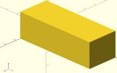


## Step 02: Space for the idler pulley

```cpp
    /* --------------- step 02 ---------------------------  
      Space for the idler pulley

           Z
           :
           :_______________________
           |                 ______|....
           |              f2/          + idler_h
           |               |           :
           |              f1\______....:
           |_______________________|...wall_thick.......> Y
                           :       :
                           :.......:
                              +
                            2 * idler_r_xtr
    */
    translate ([-1, tens_l - 2*idler_r_xtr, wall_thick])
    {
      difference () {
        // y+1: outer side of Y, to avoid manifold
        // z+2: 2 sides of Z to avoid manifold 
        cube([tens_w+2, 2 * idler_r_xtr +1, idler_h]);
        // fillet f1
        fillet_dif_x (r=in_fillet, h=tens_w,
                      ydir=-1, zdir=-1, fillet=1);
        // fillet f2
        translate ([0,0,idler_h])
          fillet_dif_x (r=in_fillet, h=tens_w,
                        ydir=-1, zdir=1, fillet=1);
      }
    }  
```
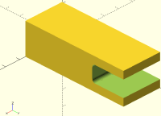


## Step 03: Fillets at the idler end

```cpp
    /* --------------- step 03 --------------------------- 
      Fillets at the idler end:

           Z
           :
           :_______________________f2
           |                 ______|
           |                /      f4
           |               |
           |                \______f3...
           |_______________________|....+ wall_thick.....> Y
           :                       f1
           :...... tens_l .........:
    */
    // fillet at the bottom f1
    translate ([0,tens_l,0])
      fillet_dif_x (r=in_fillet, h=tens_w,
                    ydir=1, zdir=-1, fillet=1);
    // fillet on top: f2
    translate ([0,tens_l,tens_h])
      fillet_dif_x (r=in_fillet, h=tens_w,
                    ydir=1, zdir=1, fillet=1);
    // fillet at the bottom, inner side: f3
    translate ([0,tens_l,wall_thick])
      fillet_dif_x (r=in_fillet, h=tens_w,
                    ydir=1, zdir=1, fillet=1);
    // fillet on top, inner side: f4
    translate ([0,tens_l,tens_h - wall_thick])
      fillet_dif_x (r=in_fillet, h=tens_w,
                    ydir=1, zdir=-1, fillet=1);

```
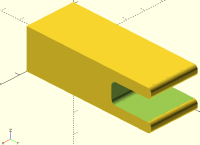


## Step 04: Chamfers at the nut end

```cpp
    /* --------------- step 04 --------------------------- 
      Chamfers at the nut end:

           Z
           :
           : ______________________
         ch2/                ______|
           |                /             
           |               |        
           |                \______
         ch1\______________________|.............> Y
           :                       :
           :...... tens_l .........:
    */
    // chamfer 1
    fillet_dif_x (r=2*in_fillet, h=tens_w,
                  ydir=-1, zdir=-1, fillet=0);                    
    // chamfer 2
    translate ([0,0,tens_h])
      fillet_dif_x (r=2*in_fillet, h=tens_w,
                    ydir=-1, zdir=1, fillet=0); 

```
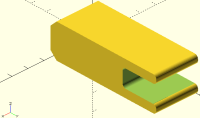


## Step 04 Optional: Chamfers at the nut end on axis Z
They are 45 degrees so they should print ok without support, but you may
not want to have them

```cpp
   /* --------------- step 04b OPTIONAL---------------------- 
      Chamfers at the nut end on axis Z, they are 45 degrees
      so they should print ok without support, but you may
      not want to have them

            ________ ....> X
        ch1/________\ch2
           |        |
           |        |
           |        |
           |        |
           |        |
           |        |
           |........|
           |        |
           |        |
           |        |
           |________|
           :
           Y
    */

    fillet_dif_z (r=2*in_fillet, h=tens_h,
                  xdir=-1, ydir=-1, fillet=0);   
    translate([tens_w,0,0])
      fillet_dif_z (r=2*in_fillet, h=tens_h,
                     xdir=1, ydir=-1, fillet=0);

```
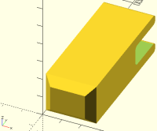


## Step 05: Shank hole for the idler pulley

```cpp
    /* --------------- step 05 --------------------------- 
      Shank hole for the idler pulley:

           Z                     idler_r_xtr
           :                    .+..
           : ___________________:__:
            /                __:_:_|
           |                /             
           |               |        
           |                \______
            \__________________:_:_|.............> Y
           :                       :
           :...... tens_l .........:
    */                    
    translate ([tens_w/2., tens_l - idler_r_xtr, -1])
        cylinder (r=boltidler_r_tol, h= tens_w +2, $fa=1, $fs=0.5);


```
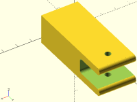
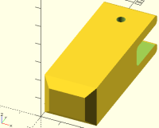
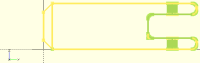

## Step 06: Hole for the leadscrew (stroke)

```cpp
    /* --------------- step 06 --------------------------- 
      Hole for the leadscrew (stroke):

           Z
           :
           : ______________________
            /      _____     __:_:_|
           |    f2/     \f4 /             
           |     |       | |        
           |    f1\_____/f3 \______
            \__________________:_:_|.............> Y
           :     :       :         :
           :     :.......:         :
           :     :   +             :
           :.....:  tens_stroke    :
           :  +                    :
           : nut_holder_total      :
           :                       :
           :...... tens_l .........:
    */
    // Space for screw (the stroke)
    translate ([-1, nut_holder_total,wall_thick])
    {
      difference () {
        // tens_w+2: 2 sides of X to avoid manifold 
        cube([tens_w+2, tens_stroke, idler_h]);

        // fillet f1
        fillet_dif_x (r=in_fillet, h=tens_w,
                      ydir=-1, zdir=-1, fillet=1);
        // fillet f2
        translate ([0,0,idler_h])
          fillet_dif_x (r=in_fillet, h=tens_w,
                        ydir=-1, zdir=1, fillet=1);

        // fillet f3
        translate ([0,tens_stroke,0])
          fillet_dif_x (r=in_fillet, h=tens_w,
                        ydir=1, zdir=-1, fillet=1);

        // fillet f4
        translate ([0,tens_stroke,idler_h])
          fillet_dif_x (r=in_fillet, h=tens_w,
                        ydir=1, zdir=1, fillet=1);
      
      }  
    }

```
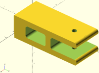
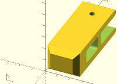


## Step 07: Hole for the leadscrew shank at the beginning

```cpp
    /* --------------- step 07 --------------------------- 
      Hole for the leadscrew shank at the beginning

           Z
           :
           : ______________________
            /      _____     __:_:_|
           |      /     \   /
           |:::::|       | |
           |      \_____/   \______
            \__________________:_:_|.............> Y
           :     :                 :
           :     :                 :
           :     :                 :
           :.....:                 :
           :  +                    :
           : nut_holder_total      :
           :                       :
           :...... tens_l .........:
    */                      
      translate ([tens_w/2, -1, tens_h/2])
        rotate ([-90,0,0])
          cylinder (r=bolttens_r_tol, h= nut_holder_total +2, $fa=1, $fs=0.5);
```
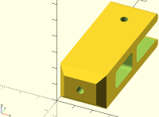
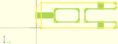


## Step 08: Hole for the leadscrew nut

```cpp
    /* --------------- step 08 --------------------------- 
      Hole for the leadscrew nut

           Z
           :
           : ______________________
            /      _____     __:_:_|
           |  _   /     \   /
           |:|_|:|       | |
           |      \_____/   \______
            \__________________:_:_|.............> Y
           :     :                 :
           :     :                 :
           :     :                 :
           :.....:                 :
           :  +                    :
           : nut_holder_total      :
           :                       :
           :...... tens_l .........:
    */                      

    // Hole for the leadscrew nut
    // tens_w/2-1 to have more tolerance, so it is a little bit deeper
    translate ([tens_w/2-1, nut_holder_thick, tens_h/2])
      //rotate ([0,90,0])
        rotate([-90,0,0]) //-90 to go to the positive side of Y
          // +stol to make it bigger. This is a hexagon for the nut,
          // not a cylinder: fn=6
          cylinder (r=m4_nut_r_tol+stol, h = nut_space, $fn=6);
   
    // Hole to insert the leadscrew nut
    // tens_h/2-1 to haver more tolerance
    translate ([tens_w/2-1, nut_holder_thick, tens_h/2-m4_nut_ap_tol])
      cube([tens_w/2 + 2, nut_space, 2*m4_nut_ap_tol]);
  }// end of difference
} // end of module

```
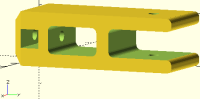
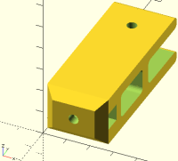


## Step 09: Rotate to print without support
```cpp
// rotate to print without support:
rotate([0,-90,0])
  idler_tens();
```


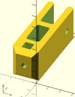

