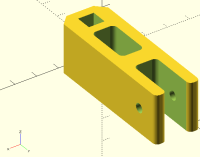
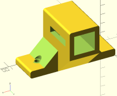

# One-axis stage to move a filter

Designed with [OpenSCAD](http://www.openscad.org)


```
 +--- src: Source files in OpenSCAD
    +--- oscad_utils: functions in OpenSCAD, https://github.com/felipe-m/oscad_utils
 +--- stl: Parts exported to STL
 +--- imgs: Images of the 4 parts in png format
    +--- small: reduced size images
    +--- tens_hold_steps: images for the step by step explanation for the tensioer holder
    +--- idler_tens_steps: images for the step by step explanation for the idler tensioner
```

 oscad_utils: are OpenSCAD functions to make bolts, chamfers and fillets, check https://github.com/felipe-m/oscad_utils

##Step by step explanations:
1. [idler_tensioner.md](./idler_tensioner.md) Detailed explanation for the idler tensioner

1. [tensioner_holder.md](./tensioner_holder.md) Detailed explanation for the tensioner holder



You can compare the same pieces using FreeCAD: https://github.com/felipe-m/freecad_filter_stage


